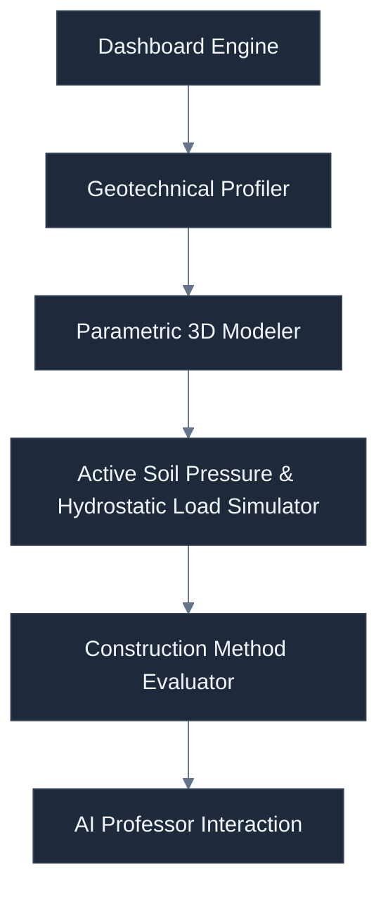
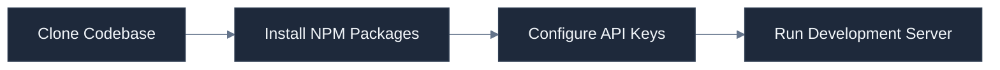
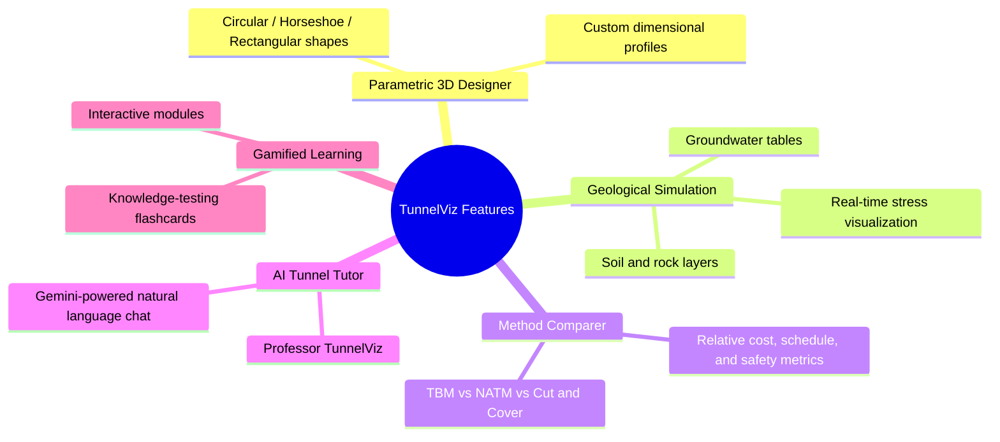
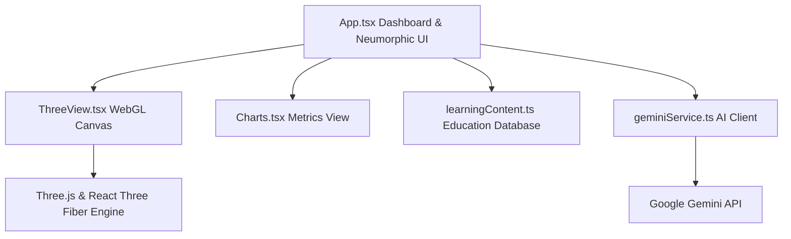

<div align="center">

# TunnelViz
### Interactive 3D tunnel engineering education platform featuring parametric design, geological simulation, and construction method comparison.
[](https://opensource.org/licenses/MIT) [](https://www.typescriptlang.org/) [](https://reactjs.org/) [](https://vitejs.dev/) [](https://threejs.org/)
**Bridge the gap between geotechnical theory and structural reality through real-time 3D parametric modeling and interactive geological simulations.**

</div>

---

## How It Works Visually



This interactive environment bridges geotechnical mechanics with real-time feedback.

You can adjust the soil layering, groundwater levels, and shape profiles to see live stress profiles.

Every change dynamically updates bending moments and surface settlements on the fly.

---

## Why This?

| Feature / Metric | **TunnelViz** | **Traditional Hand Calculations** | **Industrial FEA Tools (Plaxis/FLAC)** |
| :--- | :---: | :---: | :---: |
| **Real-time 3D Visual Feedback** | ✅ | ❌ | ❌ (requires long compute) |
| **Instant Groundwater Table Adjustments** | ✅ | ❌ (requires manual recalculation) | ❌ (requires complex mesh setup) |
| **Integrated AI Engineering Tutor** | ✅ | ❌ | ❌ |
| **Zero-Install Web Access** | ✅ | ✅ | ❌ (heavy desktop application) |
| **Cost & Learning Curve** | ✅ (Free & Intuitive) | ✅ (Free but tedious) | ❌ (Very high license cost) |

**TunnelViz delivers immediate, interactive insights for learning and early-stage visualization, bypassing complex industrial meshing workflows.**

---

## Quick Start



### Prerequisites

| Tool | Recommended Version | Purpose |
| :--- | :--- | :--- |
| **Node.js** | `>= 22.x` | JavaScript and TypeScript runtime |
| **npm** | `>= 10.x` | Dependency and script package manager |
| **Gemini API Key** | `Optional` | Powers the natural language Tunnel Tutor chat interface |

### Setup Steps

1. Clone the repository into your local workspace:
```bash
git clone https://github.com/rahulcvwebsitehosting/tunnelviz.git
```
2. Navigate directly into the project directory:
```bash
cd tunnelviz
```
3. Install all the required production and development dependencies:
```bash
npm install
```
4. Create an environment configuration file in the root directory:
```bash
echo "API_KEY=your_gemini_api_key_here" > .env
```
5. Start the local development server to preview the app:
```bash
npm run dev
```

---

## Features



### 🛠️ Parametric 3D Designer
This tool models structural geometries with live dimensional controls, allowing you to configure wall thicknesses, alignment grades, and radius settings in a WebGL viewport.

### 🌋 Geological Simulation
This module models geological strata including clay, sand, gravel, and rock, projecting hydrostatic stress vectors dynamically onto the structural skin.

### 📊 Method Comparer
This interface lets you compare **TBM**, **NATM**, and **Cut & Cover** construction techniques by dynamically graphing costs, execution schedules, and risk metrics.

### 🤖 AI Tunnel Tutor
This component embeds an expert chat agent directly into your workflow, leveraging the Google Gemini API to deliver instant civil engineering guidance.

### 🏆 Gamified Learning
This feature tracks educational progress across modular civil engineering chapters, awarding experience points (XP) and badges as you master flippable flashcard quizzes.

---

## System Architecture



### Repository Structure

```
.
├── components/
│   ├── Charts.tsx            # Recharts-based performance charts
│   └── ThreeView.tsx         # React Three Fiber 3D tunnel simulator
├── data/
│   └── learningContent.ts    # Gamified modules, chapters, and quiz questions
├── services/
│   └── geminiService.ts      # Gemini SDK integration client
├── App.tsx                   # Main layout, state machine, and Neumorphic UI
├── index.html                # HTML entrypoint with Tailwind configuration
├── index.tsx                 # React DOM bootstrapper
├── metadata.json             # Applet metadata configuration
├── package.json              # Project dependencies and scripts
├── tsconfig.json             # TypeScript compiler settings
└── types.ts                  # Shared types, interfaces, and enums
```

### Component Breakdown

| File Name | Primary Language | Functional Responsibility |
| :--- | :--- | :--- |
| **`App.tsx`** | TypeScript JSX | Orchestrates app views, manages state, and renders the Neumorphic interface |
| **`ThreeView.tsx`** | TypeScript JSX | Manages the WebGL environment, rendering soil layers, stress vectors, and structural liners |
| **`Charts.tsx`** | TypeScript JSX | Uses Recharts to plot trade-offs between construction costs, schedule durations, and risks |
| **`geminiService.ts`** | TypeScript | Standardizes prompt templates and coordinates communications with the Gemini API |
| **`learningContent.ts`** | TypeScript | Contains local educational content and structural data for the flashcard system |
| **`types.ts`** | TypeScript | Governs type-safety by defining enums for shapes, geologic materials, and parameters |

---

## Development Guide

### Technical Requirements

| Tool | Recommended Version | Purpose |
| :--- | :--- | :--- |
| **Node.js** | `v22.x` or higher | Primary runtime ecosystem |
| **Vite** | `v5.x` | Quick-reload bundling tool |
| **TypeScript** | `v5.x` | Static type analysis |

### Local Dev Workflows

1. Boot the high-performance local dev server:
```bash
npm run dev
```
2. Build the production application package:
```bash
npm run build
```
3. Test-serve the static production build locally:
```bash
npm run preview
```

**Verify your changes compile and pass static analysis before pushing changes to repository branches.**

---

## Honest Maintenance & Risks

### WebGL Hardware Requirements
The interactive 3D WebGL scenes rely heavily on client-side GPU rendering, meaning low-end hardware may encounter viewport stuttering under high-density stress vector clouds.

### API Dependencies
The intelligent tutor module depends directly on external Google Gemini service availability, falling back to static local error boundaries gracefully if rate limits are exceeded.

### Client-Side State Persistence
Application progress, badges, and scores are stored strictly inside the local web browser memory, meaning a cache clear will fully reset your accumulated learning records.

### Update & Security Strategy
The development team commits to maintaining library dependencies and updating three.js configurations regularly to prevent security vulnerabilities.

---

## FAQ

### Does TunnelViz support complete offline usage?
The core parametric designer, chart engines, and geological simulator run entirely offline in your browser, while only the AI Tunnel Tutor requires active internet connectivity.

### What is the open-source license and status of the project?
The project is fully open-source under the MIT License, enabling you to fork, modify, and distribute the engine freely.

### How is user data and simulation parameters private?
All design parameters and geological layouts are processed strictly on your local device and are never transmitted to external servers.

### Are my Gemini API keys secure when running this in AI Studio or production?
API keys are securely mapped through server-side environment variables and are never exposed to public client-side browser sessions.

### Can I add custom geological material properties or new tunnel geometries?
You can easily extend the available materials and design behaviors by adding definitions to the TypeScript enums in the shared types schema.

### Is there a headless or command-line version of the simulation engine?
While currently integrated with the React-based WebGL views, the mathematical formulas can be decoupled into a standalone command-line Node.js script.

---

## Contributing

### Community Channels

- Report unexpected design bugs and UI regressions directly on our [Issue Tracker](https://github.com/rahulcvwebsitehosting/tunnelviz/issues).
- Propose new features and geological simulations via our [Feature Requests Board](https://github.com/rahulcvwebsitehosting/tunnelviz/issues).
- Share community announcements and new educational curricula inside our GitHub [Releases Section](https://github.com/rahulcvwebsitehosting/tunnelviz/releases).

### Local Contribution Protocol

1. Fork the upstream repository to your own personal GitHub account.
2. Create an isolated, descriptive branch tracking your feature additions:
```bash
git checkout -b feature/amazing-geology
```
3. Commit your tested structural or geological source code enhancements:
```bash
git commit -m "feat: add advanced weathered slate strata"
```
4. Push your local branch to your remote fork:
```bash
git push origin feature/amazing-geology
```
5. Open a detailed, structured Pull Request outlining your technical changes.

---

## License & Attribution

This project is licensed under the permissive [MIT License](https://opensource.org/licenses/MIT).

We sincerely thank the open-source maintainers of **Three.js**, **React Three Fiber**, and **Recharts** for empowering web-based engineering interfaces.
